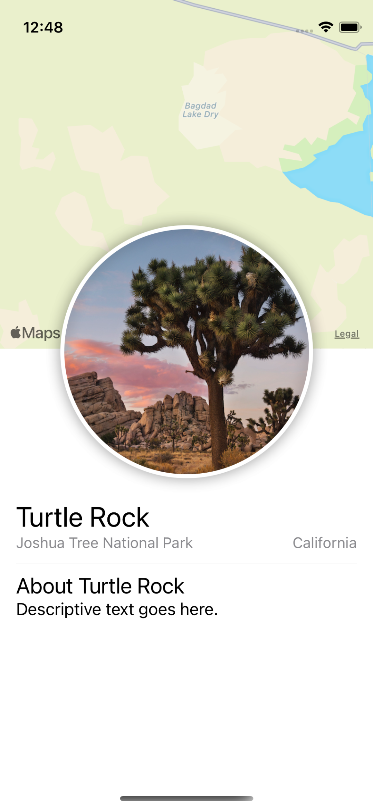

<!-- PROJECT LOGO -->
 

  

  <h3 align="center">❤️ LAND MARK ❤️</h3>

  

    <samp>✨A LAND MARKS IOS APP✨</samp>
     
        <samp>✨BEING BUILT AT THE MOMENT, SO HANG TIGHT✨</samp>  
  
  
  
    

    

## GUIDE:
COMING SOON (WORKING ON IT).

<!-- BUILT USING -->
## BUILT WITH
* SWIFT.
* SWIFTUI.
 
<!-- CONTRIBUTING GUIDELINES -->
<!-- LICENSE -->
## Copyright

Copyright © 2022 [Adam - ATOM LAB X](https://AtomLabX.Dev)

